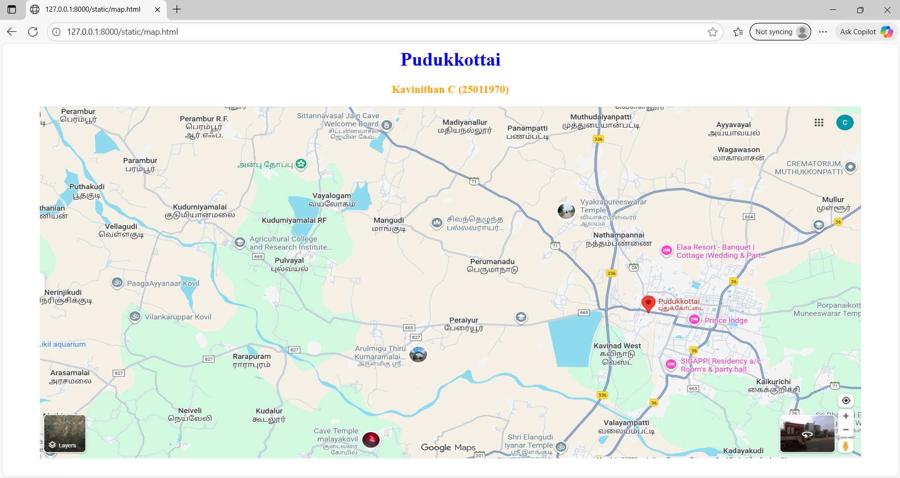
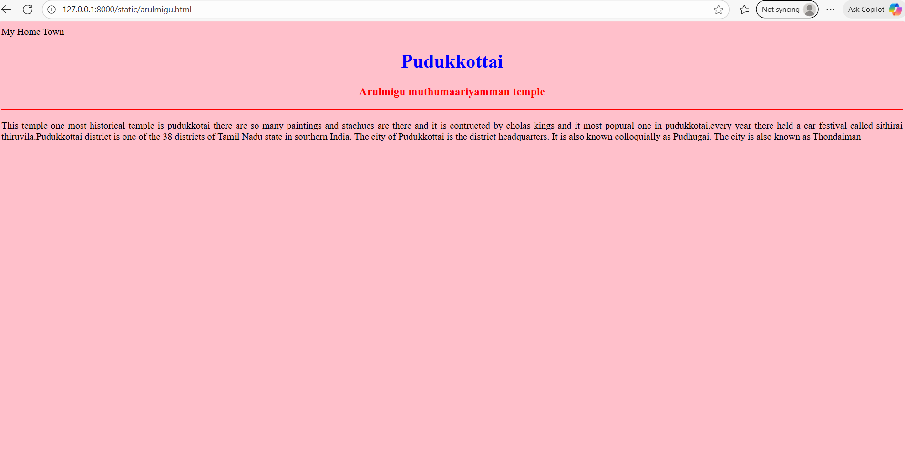
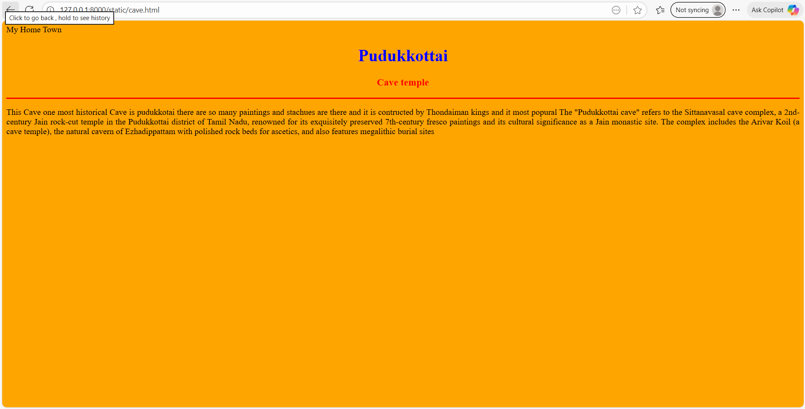
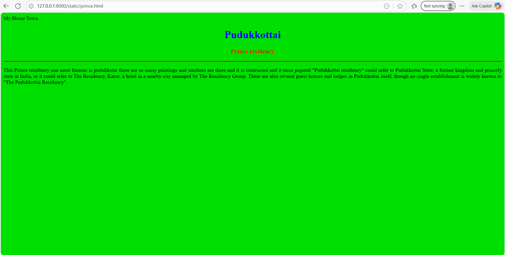
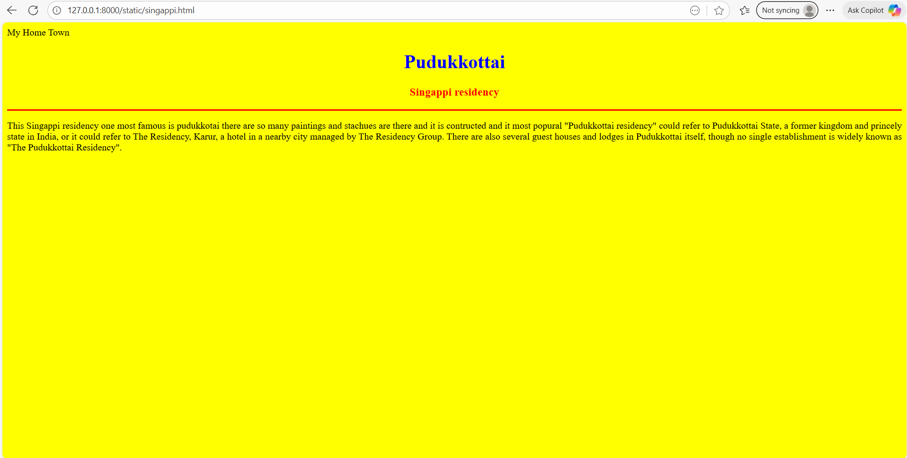
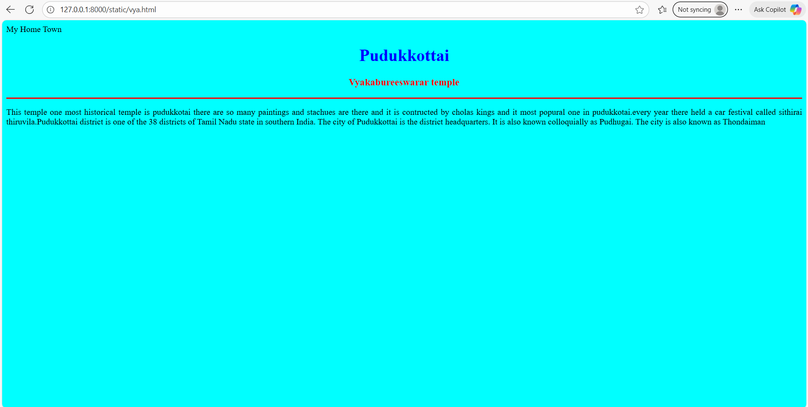

# Ex04 Places Around Me
## Date: 27.09.2025

## AIM
To develop a website to display details about the places around my house.

## DESIGN STEPS

### STEP 1
Create a Django admin interface.

### STEP 2
Download your city map from Google.

### STEP 3
Using ```<map>``` tag name the map.

### STEP 4
Create clickable regions in the image using ```<area>``` tag.

### STEP 5
Write HTML programs for all the regions identified.

### STEP 6
Execute the programs and publish them.

## CODE
```
map.html

<html>
    <head>
        <tittle></tittle>
        <link rel ="stylesheet" href="style.css">
    </head>
    <body>
        <h1 align="center">
            <font color="blue"><b>Pudukkottai</b>
            </font>
        </h1>
        <h3 align="center">
            <font color="orange"><b>Kavinithan C (25011970)</b></font>
        </h3>
        <center>


<map name="image-map">
    <area target="" alt="vya temple" title="vya temple" href="" coords="1171,219,1418,297" shape="rect">
    <area target="" alt="cave temple" title="cave temple" href="" coords="704,851,117" shape="circle">
    <area target="" alt="sigappi res" title="sigappi res" href="" coords="1445,625,1627,625,1688,655,1624,699,1458,702,1403,664" shape="poly">
    <area target="" alt="prince lodge" title="prince lodge" href="" coords="1487,529,1644,569" shape="rect">
    <area target="" alt="arulmigu" title="arulmigu" href="" coords="799,636,108" shape="circle">
</map>

</center>
   </body>
</html>

arulmigu.html

<html>
    <head>
        <tittle>
            My Home Town
        </tittle>
    </head>
    <body bgcolor="pink">
        <h1 align="center">
            <font color="blue"><b>Pudukkottai</b></font>
        </h1>
        <h3 align="center">
            <font color="red"><b>Arulmigu muthumaariyamman temple</b></font>
        </h3>
        <hr size="3" color="red">
        <P align="justify">
            <font face="Georgia" size="5"></font>
            This temple one most historical temple is pudukkotai there are so many paintings
            and stachues are there and it is contructed by cholas kings and it most popural
            one in pudukkotai.every year there held a car festival called sithirai thiruvila.Pudukkottai district is one of the 38 districts of Tamil
             Nadu state in southern India. The city of Pudukkottai is the district headquarters. It is also known colloquially as Pudhugai. The city is also known as Thondaiman
        </P>
        </body>
</html>

cave.html

<html>
    <head>
        <tittle>
            My Home Town
        </tittle>
    </head>
    <body bgcolor="orange">
        <h1 align="center">
            <font color="blue"><b>Pudukkottai</b></font>
        </h1>
        <h3 align="center">
            <font color="red"><b>Cave temple</b></font>
        </h3>
        <hr size="3" color="red">
        <P align="justify">
            <font face="Georgia" size="5"></font>
            This Cave one most historical Cave is pudukkotai there are so many paintings
            and stachues are there and it is contructed by Thondaiman kings and it most popural
            The "Pudukkottai cave" refers to the Sittanavasal cave complex, a 2nd-century Jain rock-cut temple in the Pudukkottai district of Tamil Nadu,
             renowned for its exquisitely preserved 7th-century fresco paintings and its cultural significance as a Jain monastic site. The complex includes the Arivar Koil (a cave temple), the natural cavern of Ezhadippattam
              with polished rock beds for ascetics, and also features megalithic burial sites
        </P>
        </body>
</html>

prince.html

<html>
    <head>
        <tittle>
            My Home Town
        </tittle>
    </head>
    <body bgcolor="lite blue">
        <h1 align="center">
            <font color=" blue"><b>Pudukkottai</b></font>
        </h1>
        <h3 align="center">
            <font color="red"><b>Prince residency</b></font>
        </h3>
        <hr size="3" color="red">
        <P align="justify">
            <font face="Georgia" size="5"></font>
            This Prince residency one most famous is pudukkotai there are so many paintings
            and stachues are there and it is contructed and it most popural
            "Pudukkottai residency" could refer to Pudukkottai State, a former kingdom and princely state in India,
             or it could refer to The Residency, Karur, a hotel in a nearby city managed by The Residency Group. There are also several guest houses and lodges in Pudukkottai itself,
             though no single establishment is widely known as "The Pudukkottai Residency". 
        </P>
        </body>
</html>

singappi.html

<html>
    <head>
        <tittle>
            My Home Town
        </tittle>
    </head>
    <body bgcolor="yellow ">
        <h1 align="center">
            <font color=" blue"><b>Pudukkottai</b></font>
        </h1>
        <h3 align="center">
            <font color="red"><b>Singappi residency</b></font>
        </h3>
        <hr size="3" color="red">
        <P align="justify">
            <font face="Georgia" size="5"></font>
            This Singappi residency one most famous is pudukkotai there are so many paintings
            and stachues are there and it is contructed and it most popural
            "Pudukkottai residency" could refer to Pudukkottai State, a former kingdom and princely state in India,
             or it could refer to The Residency, Karur, a hotel in a nearby city managed by The Residency Group. There are also several guest houses and lodges in Pudukkottai itself,
             though no single establishment is widely known as "The Pudukkottai Residency". 
        </P>
        </body>
</html>

vya.html

<html>
    <head>
        <tittle>
            My Home Town
        </tittle>
    </head>
    <body bgcolor="cyan">
        <h1 align="center">
            <font color="blue"><b>Pudukkottai</b></font>
        </h1>
        <h3 align="center">
            <font color="red"><b>Vyakabureeswarar temple</b></font>
        </h3>
        <hr size="3" color="red">
        <P align="justify">
            <font face="Georgia" size="5"></font>
            This temple one most historical temple is pudukkotai there are so many paintings
            and stachues are there and it is contructed by cholas kings and it most popural
            one in pudukkotai.every year there held a car festival called sithirai thiruvila.Pudukkottai district is one of the 38 districts of Tamil
             Nadu state in southern India. The city of Pudukkottai is the district headquarters. It is also known colloquially as Pudhugai. The city is also known as Thondaiman
        </P>
        </body>
</html>
```


## OUTPUT







## RESULT
The program for implementing image maps using HTML is executed successfully.
